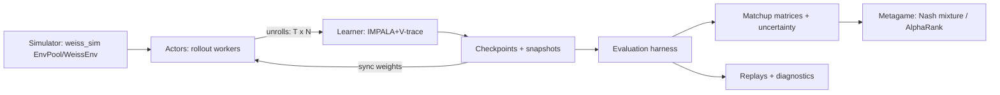

# Weiss Schwarz RL — Single Source of Truth (Master Plan)

**Version:** 2.0 (consolidated + aligned)  
**Date:** 2026-02-23  
**Owners:** thesis authors (RL pipeline)  
**Scope:** Python RL training + evaluation system. The simulator is prerequisite infrastructure, not the thesis contribution.

> It is the **only** authoritative plan going forward.  
> If this plan conflicts with the simulator contract, **the simulator contract wins** and this plan must be updated accordingly.

---

## Table of contents

1. [Purpose & thesis alignment](#1-purpose--thesis-alignment)  
2. [What the simulator already guarantees (contract + constants)](#2-what-the-simulator-already-guarantees-contract--constants)  
3. [Non-negotiables (paper-grade invariants)](#3-non-negotiables-paper-grade-invariants)  
4. [End-to-end architecture](#4-end-to-end-architecture)  
5. [Environment interfaces](#5-environment-interfaces)  
6. [Observation, action, legality, masking](#6-observation-action-legality-masking)  
7. [Trajectory schema (storage contract)](#7-trajectory-schema-storage-contract)  
8. [Model architecture (recurrent actor-critic)](#8-model-architecture-recurrent-actor-critic)  
9. [Learning algorithm (IMPALA + V-trace)](#9-learning-algorithm-impala--v-trace)  
10. [Actor–learner system design](#10-actorlearner-system-design)  
11. [Experiment families (A/B/C) + defaults](#11-experiment-families-abc--defaults)  
12. [League self-play](#12-league-self-play)  
13. [Reproducibility: identities, hashing, seeds](#13-reproducibility-identities-hashing-seeds)  
14. [Evaluation protocol (reviewer-proof)](#14-evaluation-protocol-reviewer-proof)  
15. [Metagame analysis (Nash mixture + AlphaRank)](#15-metagame-analysis-nash-mixture--alpharank)  
16. [Diagnostics & anti-footguns](#16-diagnostics--anti-footguns)  
17. [Artifacts: run directory + file contracts](#17-artifacts-run-directory--file-contracts)  
18. [Replay debugging workflow](#18-replay-debugging-workflow)  
19. [Baselines](#19-baselines)  
20. [Compute budget + calibration](#20-compute-budget--calibration)  
21. [Milestones, done criteria, and risks](#21-milestones-done-criteria-and-risks)  
22. [Repository layout (canonical) + module map](#22-repository-layout-canonical--module-map)  
23. [Appendix: default configs (L40-ish node)](#23-appendix-default-configs-l40-ish-node)  

---

## 1. Purpose & thesis alignment

### 1.1 Thesis objective (what we are proving)

We train reinforcement learning agents in a **partially observable**, **stochastic**, **two-player** card game (Weiss Schwarz) using **scalable self-play**. The scientific contribution is not “a simulator”, but a **thesis-grade training + evaluation pipeline** that is:

- strict about environment/trajectory contracts (no ambiguity about “what is a step”)
- strict about **legal-action masking** (single source of truth, no silent fixes)
- supports **recurrent memory** for hidden information (GRU)
- reproducible by **stable hashes + pinned seeds**
- evaluated with reviewer-proof methodology: **seat-swapped matchup matrices**, uncertainty-aware aggregation, and **metagame-style summaries** (Nash-mixture / equilibrium-oriented reporting)

### 1.2 Scope boundaries (what we are *not* claiming)

- Not “solving Weiss Schwarz” globally (no full card pool generalization claims).
- Not deck-building / drafting research.
- Not claiming provable Nash equilibrium—only **equilibrium-oriented evidence** under a fixed environment configuration and evaluation protocol.
- Simulator details (rules coverage, content DB) are prerequisite infrastructure; we treat them as fixed.

---

## 2. What the simulator already guarantees (contract + constants)

This project is **simulator-constrained**: everything here must be doable with the simulator as-is.

### 2.1 Core stepping semantics (decision-boundary stepping)

The simulator exposes **advance-until-decision** stepping:

- You provide **exactly one action id** for the current decision boundary.
- The engine applies it, then advances internally until the **next decision boundary** (or terminal/truncated).
- A single external `step()` may cover many internal engine transitions.

This is the *DecisionEnv* primitive we build everything else on.

### 2.2 Reward semantics (important!)

Simulator rewards are reported **from the acting player’s perspective** at the boundary:

- If shaping is disabled: non-terminal rewards are `0.0`.
- Terminal rewards use configured `terminal_win`, `terminal_loss`, `terminal_draw`.

This is ideal for symmetric self-play: one shared policy can act for both seats and receive correctly signed rewards relative to the seat that acted.

### 2.3 Legal action surfaces + invariants

Simulator legality is derived once in Rust, then exposed as **views**:

- Dense masks (`mask_u8`) and/or
- Packed legal ids (`ids_u16` / `ids_u32`) with `legal_offsets`.

Key invariants in the high-level path:

- `terminated` and `truncated` are never both true for the same env index.
- Legal ids (when present) are **strictly ascending and unique** per env slice.

### 2.4 Compatibility constants (current baseline)

The simulator exposes explicit compatibility boundaries (must be persisted with runs):

- `OBS_LEN = 378`
- `ACTION_SPACE_SIZE = 527`
- `OBS_ENCODING_VERSION = 2`
- `ACTION_ENCODING_VERSION = 1`
- `PASS_ACTION_ID = 51`
- `SPEC_HASH = 8590000130` (integer compatibility hash; treat as stable boundary)
- `POLICY_VERSION` (separate from encoding versions)

**Rule:** any run artifacts must record the entire spec bundle (see below) and must fail fast on mismatches unless an explicit migration step is applied.

### 2.5 Spec bundle handshake (authoritative field layout)

The simulator exports a runtime JSON/dict spec bundle containing:

- encoding versions
- action space size, pass id
- observation dtype and length
- compatibility hash (and often more)

**Rule:** our RL pipeline reads the spec bundle at startup, stores it verbatim in the run manifest, and verifies it for every evaluation.

### 2.6 Relevant simulator integration surfaces we rely on

We will rely on these public `weiss_sim` surfaces:

High-level:

- `weiss_sim.make(...)` / `weiss_sim.fast(...)` / `weiss_sim.inspect(...)` -> `WeissEnv`
- `ResetBatch` / `StepBatch` (includes `obs`, `to_play_seat`, `decision_id`, `episode_seed`, `episode_key`, `engine_status`, legal surfaces). **Note:** `decision_kind` is not assumed to exist in these batches; if we need “decision kind” analytics, we derive a tag in Python.

Low-level (throughput):

- `EnvPool` + buffer wrappers (`EnvPoolBuffers`, trajectory buffers)
- RL helpers: `reset_rl(pool, layout=...)`, `step_rl(pool, actions, layout=...)`
- Optional helper stepping from logits: `step_rl_select_from_logits`, `step_rl_sample_from_logits` (useful for baselines and for “rust selection only” benchmarks)

Replays / drift:

- replay sampling hooks (enabled via environment options) + episode keys / seeds for deterministic replay.

---

## 3. Non-negotiables (paper-grade invariants)

These are paper-grade rules. You can relax them in local iteration profiles, but **paper family runs must obey them**.

### 3.1 No silent fixes

Paper-grade runs must never:

#### 3.1.1 Legal-ID ordering is a contract (enforcement by profile)

The simulator high-level API guarantees strictly ascending, unique legal ids when ids are present.
Even so, our pipeline enforces *visibility* of violations (no silent sorting), with different checking rates:

- `debug`: assert every step (rate = 1.0), hard fail
- `balanced`: assert with `r_sorted_check` (1.0 during bring-up; then 0.01), hard fail
- `fast`: do not sort; spot-check `r_sorted_check=0.001`, hard fail if violated
- **paper-grade evaluation override**: assert every step (rate = 1.0), never auto-sort

- auto-sort legal IDs
- clamp/correct NaNs/Infs in logits/probs
- “fix-and-continue” contract violations
- silently renormalize distributions except for a *documented* CDF rounding guard in evaluation

Violations must hard-fail (at least in evaluation). Training profiles may optionally “replace” engine errors for throughput, but paper runs must record and report them.

### 3.2 Single source of truth for legality and masking

- There is **one** masking implementation used by:
  - action sampling
  - behavior log-prob computation
  - target log-prob computation
  - entropy and top-k
- No duplicated “masking logic” in multiple files.

### 3.3 Evaluation must be pinned and device-independent

Paper-grade evaluation uses:

- `model.eval()` and inference mode
- default eval device: **CPU**
- pinned RNG and pinned sampling algorithm (no CUDA-dependent sampling)
- strict checks for NaN/Inf logits/probs/logp

### 3.4 Deterministic identities

Each run/episode must be identifiable and reproducible via:

- a stable spec hash/bundle
- stable config hash
- stable seed derivation
- deterministic episode keys (or simulator-provided episode_key if it is deterministic)

### 3.5 Time-scale ambiguity must be eliminated (explicit step definition)

For each experiment family we define:

- the step definition (decision boundary vs learner-turn wrapper)
- reward mode (terminal-only vs shaping)
- discounting convention (gamma=1.0 default for terminal-only)

No “semi-MDP” ambiguity allowed: if internal decision counts are folded, they must be recorded (`k_raw_decisions`) and discounting must be defined accordingly.

---

## 4. End-to-end architecture

### 4.1 High-level dataflow



### 4.2 Core pillars

1. **Contract correctness**: strict env + trajectory schemas.
2. **Scalability**: actor/learner split, batched stepping, queueing.
3. **Partial observability**: recurrent policy (GRU) + seat-separated hidden state.
4. **Evaluation first**: matchup matrices, fixed seeds, seat swap, uncertainty, metagame.

---

## 5. Environment interfaces

We standardize two environment interfaces. Both are implementable using the simulator as-is.

### 5.1 DecisionBoundaryEnv (canonical primitive; simulator-native)

**Definition:** one external step corresponds to one simulator decision boundary.

**reset() returns:**

- obs for the seat to act
- legal actions for that boundary (ids and/or mask)
- metadata: `to_play_seat`, `starting_seat`, `episode_seed`, `episode_key`, `decision_id`, `engine_status`, `spec_hash`, etc.

**step(action_id) returns:**

- next boundary’s observation + legality
- reward from **acting seat’s perspective**
- `terminated` / `truncated`

This is the default interface for:

- evaluation (always)
- training (default; symmetric self-play with seat-separated memory)

### 5.2 LearnerTurnEnv (optional wrapper; “one step = one learner decision”)

**Motivation:** sometimes we want a step definition where the learner only decides for one seat, and opponent decisions are stepped internally by a provided opponent policy.

**Definition:** one external step = (learner makes one decision) then environment advances via opponent decisions until it is learner’s turn again or terminal.

**What it must return:**

- next learner observation + legality
- reward in learner’s perspective
- `done`
- `k_raw_decisions >= 1`: number of underlying DecisionBoundaryEnv steps executed (including learner decision)
- `terminal_during_opponent_internal`: whether terminal happened during opponent’s internal decisions

**Implementation note:** this wrapper is purely Python: it calls DecisionBoundaryEnv.step() repeatedly, choosing opponent actions using the opponent policy. No simulator changes required.

### 5.3 Training profiles and env configuration mapping

We keep explicit profiles to align performance vs debuggability. Profiles configure *both* simulator settings and our RL pipeline checks.

| Profile    | Primary use          | Simulator legal repr | Simulator obs dtype | RL legality storage | Contract enforcement          |
| ---------- | -------------------- | -------------------- | ------------------- | ------------------- | ----------------------------- |
| `debug`    | bring-up, invariants | `both` or `mask_u8`  | `i32`               | keep masks + ids    | assert-every-step, hard fail  |
| `balanced` | dev training         | `mask_u8` or `both`  | `i16` or `i32`      | keep masks          | assert with sampling, fail    |
| `fast`     | main-scale training  | `ids_u16`            | `i16`               | packed ids+offsets  | spot-check, fail on violation |

Notes:

- `fast` is the default for main training runs.
- Evaluation is always paper-grade regardless of training profile.

---

## 6. Observation, action, legality, masking

### 6.1 Observation representation rules

- Observations are fixed-length vectors (`OBS_LEN=378`) with a versioned encoding.
- The simulator defines layout; we treat it as authoritative and log the spec bundle.
- Observation visibility modes (public/full) do not change layout indices; they only sanitize values.

**Policy input:** We treat observation vector as typed features:

- categorical IDs (cards, decision kind, to-play seat, etc.) -> embeddings
- bounded counts/scalars -> normalized float features
- optional zone summaries

### 6.2 Action space rules

- Fixed action-id space size `ACTION_SPACE_SIZE=527`.
- Action IDs are global and stable across runs for a given encoding version.
- Legality depends on decision kind; pass action exists (`PASS_ACTION_ID=51`).

### 6.3 Legal actions: packed ids contract

When using packed legality:

- `legal_offsets` has shape `(num_envs + 1,)` and starts at 0.
- For env i: legal set is `legal_ids[legal_offsets[i] : legal_offsets[i+1]]`.
- Legal ids must be strictly ascending and < action_space.

### 6.4 Masking rule (normative)

Given logits `z` over global action space `A`, and legal set `L`:

- for `a ∈ L`:  π(a) = exp(z[a]) / Σ_{b∈L} exp(z[b])
- for `a ∉ L`:  π(a) = 0

**All** probabilities/log-probs used in learning must correspond to this masked distribution.

### 6.5 Log-prob from legal ids (fast path)

When only legal ids are available, compute:

`logp(action) = z[action] - logsumexp(z[L])`  where `L` is the legal-id slice.

This allows:

- behavior logp computed on the actor without a dense mask
- importance ratios computed correctly
- faster memory footprint than storing dense masks

### 6.6 Pass-action fallback (no-legal edge case)

If a boundary returns no legal actions (should be rare), we define:

- action = `PASS_ACTION_ID`
- logp = 0.0
- entropy = 0.0
- record as a contract anomaly (debug counter)

---

## 7. Trajectory schema (storage contract)

This section merges and resolves conflicts between the old `plan.md` and `specsheet.md` into one canonical schema.

### 7.1 Trajectory unit

A trajectory chunk is a **fixed-length unroll** of decision steps:

- length `T` (default 64)
- across `N` envs per actor

We store unrolls as contiguous arrays with an explicit `TRAJ_SCHEMA_VERSION`.

### 7.2 Per-step stored fields (canonical)

For each step `t` (decision boundary), store:

1. `obs_t`: int16 or int32 vector length `OBS_LEN` (dtype is recorded)
2. `legal_ids_t`: uint16 packed 1D (optional if mask-based)
3. `legal_offsets_t`: uint32 offsets length `num_envs + 1` (optional)
4. `legal_mask_t`: uint8 mask (optional)
5. `to_play_seat_t`: int8 (0/1)
6. `decision_id_t`: int32 (monotonic per env; simulator-provided)
7. `action_t`: uint32 (selected action id)
8. `reward_t`: float32 (simulator reward, actor perspective)
9. `terminated_t`: bool
10. `truncated_t`: bool
11. `engine_status_t`: int32 or int16
12. `episode_seed_t`: uint64 (from simulator batch)
13. `episode_key_t`: uint64 or bytes (from simulator; store raw)
14. `behavior_logp_t`: float32 (log π_behavior(a_t | obs_t, legal_t))
15. `policy_version_t`: int32 (optional; from spec bundle)
16. `value_pred_t`: float32 (optional debug, from actor net)

**Optional debug / analysis fields (not required for training correctness):**

- `decision_kind_t`: int8/uint8 tag. **Not provided by high-level simulator batches.** If present, it comes from a Python-derived tagging layer and may be `"unknown"` (sentinel) for most runs.
- `legal_fingerprint64_t`: uint64 computed in the RL layer from `(decision_id_t, legal ids)` using `legal_fingerprint_v1` (see §16.6).
- `actor_t`: int8 alias of `to_play_seat_t` if a downstream tool expects the name `actor_t`. Avoid storing both unless needed.

**Chunk-level fields** (stored once per unroll):

- `run_id256`, `config_hash256`, `spec_hash256`
- `actor_id`, `env_index` mapping
- `schema_version`
- `obs_dtype`, `legal_repr`, `visibility_mode`
- git commit SHA, build info, python/torch versions

### 7.3 Reward perspective conventions (choose explicitly per experiment family)

The simulator reward is **actor perspective**. We support two learning conventions:

#### Convention P (player-to-act / actor perspective) — default

- Use `reward_t` as-is.
- Value head predicts `V(obs_t)` in the **actor’s perspective**.
- Policy loss computed on all steps.

This uses all decisions as training data and matches simulator semantics naturally.

#### Convention L (fixed learning seat per episode) — optional

- Choose `learning_seat` per episode (randomized).
- Transform rewards:
  - if `actor_t == learning_seat`: `r_learn_t = +reward_t`
  - else: `r_learn_t = -reward_t`
- Policy loss computed **only** on learner steps (`actor_t == learning_seat`).
- Value head predicts learner-seat outcome.

This matches “LearnerTurnEnv” style training and yields a single-seat value interpretation, but uses fewer policy-gradient steps unless we run two learners or seat randomization.

### 7.4 Termination / truncation bootstrapping

- If `terminated`: no bootstrap, discount=0 at terminal.
- If `truncated`: bootstrap allowed (if configured) using learner value at chunk end.
- Simulator faults are represented via `engine_status != 0` and typically `truncated=True`. Paper-grade evaluation treats any faults as hard failures.

### 7.5 Trajectory schema versioning

- Define `TRAJ_SCHEMA_VERSION = 1` initially.
- Any field meaning/layout change requires bumping version and adding a migration note.

---

## 8. Model architecture (recurrent actor-critic)

### 8.1 Overview

A shared-weight recurrent actor-critic with seat-separated memory:

- encoder maps observation vector -> latent
- GRU maintains memory state
- policy head outputs logits over global action space
- value head outputs scalar value

### 8.2 Seat-separated hidden state

Because the game is two-player with alternating decisions and hidden information:

- maintain hidden state **per seat** per env: `h[env, seat, H]`
- at each decision, update only the acting seat’s GRU state
- the non-acting seat’s hidden state must not affect outputs for the acting seat (poison test required)

### 8.3 Suggested encoder (stable and implementable)

Given the simulator’s fixed vector encoding, we implement:

- Split obs into:
  - header fields (decision kind, to_play seat, phase, etc.)
  - per-player blocks x2
  - reveal history tail
  - context tail
- For categorical ranges: use embeddings (card IDs, decision kind, etc.)
- For counts/scalars: normalize to float32 (e.g., divide by max)
- Concatenate -> MLP -> GRU

Default sizes:

- GRU hidden size H = 256
- MLP width = 256, layers = 2
- LayerNorm enabled
- Dropout: 0.0 for paper family A; 0.1 for ablations only

### 8.4 Output heads

- Policy logits over `ACTION_SPACE_SIZE` (527).
- Value scalar:
  - Convention P: value in [-1,1] from actor perspective (terminal-only family) or unbounded if shaping (still keep stable scale).
  - Convention L: value in [-1,1] from learning seat perspective.

### 8.5 Optional large-action-space head (future-proof)

If action space expands:

- consider action embeddings + dot-product head
- keep backward compatibility for current 527

---

## 9. Learning algorithm (IMPALA + V-trace)

### 9.1 Why IMPALA

IMPALA is an actor–learner architecture where actors send trajectories and the learner updates centrally. It scales environment interaction throughput and uses V-trace off-policy correction to handle policy lag.

### 9.2 V-trace targets (normative)

We implement standard V-trace with clipping parameters `rho_bar` and `c_bar`.

For each unroll:

- store behavior logp from actor policy
- compute target logp under learner policy
- compute importance ratios and clipped weights
- compute V-trace corrected value targets `v_s`
- compute policy-gradient advantages

We log:

- rhos percentiles
- clip rates
- approx KL between behavior and target

### 9.3 Hyperparameters (initial defaults)

- Unroll length `T=64`
- Batch unrolls per update: `128` (paper family A default) or `64` (small bring-up)
- `gamma=1.0` for terminal-only family; otherwise `0.99` for shaping/discount ablations
- `rho_bar=1.0`, `c_bar=1.0`
- Adam lr `2e-4`
- grad norm clip `40`
- value loss coef `0.5`
- entropy coef `0.01` anneal -> `0.001` over 2M updates

### 9.4 Discounting with learner-turn folding (only if used)

If using LearnerTurnEnv wrapper and internal steps count `k_raw_decisions`:

- define `gamma_step = gamma_raw ** k_raw_decisions`
- store `k_raw_decisions` per learner step for correct discounting

Paper family A avoids this by using terminal-only reward and gamma=1.0.

---

## 10. Actor–learner system design

### 10.1 Components

- **Actors**: run environment pools, generate unrolls with behavior policy, compute behavior logp, send to learner.
- **Learner**: receives batches, computes loss (V-trace), updates parameters, checkpoints.
- **Parameter sync**: periodic actor refresh from learner.
- **League manager**: manages opponent pool and snapshot selection.
- **Evaluation harness**: runs seat-swapped matchups on fixed seeds, produces matrices and uncertainty artifacts.

### 10.2 Actor loop (DecisionBoundaryEnv default)

For each actor process:

1. create `EnvPool` or `WeissEnv` in `fast` mode (ids_u16, obs i16) for throughput
2. maintain per-env per-seat hidden states
3. at each step:
   - get `to_play_seat`
   - forward policy for acting seat
   - compute masked distribution from legal ids or mask
   - sample action
   - compute behavior logp (masked)
   - step env
   - write step fields into unroll buffer
4. after `T` steps per env, package unroll and enqueue to learner

### 10.3 Learner loop

1. dequeue unrolls into batch
2. run learner forward pass over `T+1` observations (and GRU unroll) to compute logits and values
3. compute target logp under masked distribution
4. compute V-trace targets and policy advantages
5. backprop, optimizer step, gradient clipping
6. log metrics + write checkpoints
7. periodically snapshot policy for league/eval

### 10.4 Action selection location (Python vs Rust)

We support a runtime flag:

- `action_selection = python | rust`

Default:

- training: Python (to guarantee masking/logp consistency and avoid hidden sampling differences)
- benchmarks: allow Rust selection helpers for speed comparisons

Evaluation never uses Rust sampling unless it is explicitly proven device-independent and pinned.

### 10.5 Storage optimizations (optional)

For actor-perspective training we store full data on every decision.

Optionally:

- store full fields only on “learning” steps and minimal on opponent steps (only if using Convention L). This reduces memory but increases complexity; keep behind a flag.

---

## 11. Experiment families (A/B/C) + defaults

We define experiment families as named, pinned configurations. Paper claims must reference a family name.

### 11.1 Family A (paper default; must exist)

**Goal:** remove shaping ambiguity and use a clear terminal outcome value.

- Step definition: DecisionBoundaryEnv (default) OR LearnerTurnEnv (allowed, but must be stated)
- Reward: terminal-only (shaping disabled)
  - win +1, loss -1, draw/timeout 0
  - truncation reward in training: 0 (but report truncation rate)
- Discount: `gamma = 1.0`
- Value head predicts expected terminal outcome in [-1,+1]
- Evaluation uses Public visibility, fixed seeds, seat swap

### 11.2 Family B (optional ablation: discounting)

Only allowed if we record internal step counts (or define discount per decision step explicitly).

- Reward: terminal-only
- Discount: `gamma = 0.99` (ablation)
- If LearnerTurnEnv folding is used:
  - `gamma_step = gamma ** k_raw_decisions`
- Otherwise: `gamma` applies per decision step.

### 11.3 Family C (fallback shaping; only if stalled)

Shaping is never enabled in Family A.

If training stalls, enable **bounded shaping**:

- keep terminal ±1
- add per-learner-step penalty `-λ / max_steps_per_episode`
- λ default 0.10 (total shaping magnitude ≤ 0.10 per episode)
- truncation reward still 0

**Stall condition (explicit):**
After `U = 500,000` updates:

- evaluate champ vs RandomLegal on `dev_eval_seeds.txt` with seat swap
- compute `P(winrate > 0.55)` using default uncertainty method
- if `< 0.60`, declare stalled and run Family C.

### 11.4 Baseline requirements (must exist)

- **B0 RandomLegal** (eval-only): uniform over legal actions per decision.
- **B1 No-league baseline** (training run): same learner/model, but opponent sampling is not PFSP (uniform over fixed opponents or latest only).
- **B2 HeuristicPublic** (optional but preferred): deterministic, public-only, IP-safe.

---

## 12. League self-play

### 12.1 Self-play modes

- **Mirror self-play:** same weights both seats; hidden states separated by seat.
- **Population self-play:** opponent sampled from a pool of snapshots (league).

### 12.2 Snapshotting

- snapshot interval: every `N` updates (default 100k updates)
- keep:
  - last `recent_size` snapshots (default 24)
  - `champion_size` snapshots (default 4)

### 12.3 PFSP opponent sampling

Prioritized Fictitious Self-Play (PFSP) using recent win rates:

- sample probability ∝ (1 - winrate)^p with smoothing
- `pfsp_power p = 2.0`
- `pfsp_epsilon_uniform = 0.2`
- statistics source: online outcomes with sliding window (default 50k episodes after warmup)

### 12.4 Promotion gate (paper-grade)

A snapshot is eligible to enter the opponent pool only if it passes a **reproducible** promotion gate.

#### 12.4.1 Fixed anchor set (AnchorSet_v1)

The anchor opponents are a *fixed, explicitly named* set:

- `B0 RandomLegal` (always present)
- `B1 NoLeague baseline` (mandatory training baseline run, frozen snapshot)
- `B2 HeuristicPublic` (optional; if not implemented, it is omitted)

This set is **the** anchor set used for the promotion gate. (You may add extra “champion anchors” as a stricter optional gate, but that is not required for the paper family.)

#### 12.4.2 Gate procedure (normative)

- paired seeds: `promotion_gate_paired_seeds = 64` from `promotion_eval_seeds.txt` (committed; file hash stored in manifest)
- seat swap: always (2 games per seed per anchor opponent)
- folding: S0 (win=1, loss=0, draw=0.5, trunc=0.5), seed-level paired mean

Compute the posterior `P(p_anchor > 0.55)` using the same uncertainty method as evaluation (default: Bayesian bootstrap over paired seed scores):

- for each anchor opponent `i`, compute paired seed scores `{s}` from seat-swapped games
- concatenate all paired seed scores across all anchors (this implements **uniform weighting** across anchors)
- gate passes if `P(p_anchor > 0.55) > 0.95`

Hard guardrails (must also hold):

- for every anchor opponent `i`: `P(p_i < 0.45) < 0.05` (do not admit snapshots that are decisively losing to any anchor)
- truncation rate in the gate set ≤ 5% (otherwise treat as “not promotable” and investigate)

Record in `promotion_gate.json`: ordered opponent list, seed file hash, posterior summary, and the decision.

### 12.5 Seat randomization

Training must randomize which seat the “main” policy controls per episode if using Convention L, or just run symmetric if using Convention P.

---

## 13. Reproducibility: identities, hashing, seeds

### 13.1 Core IDs (store full 256-bit)

We define stable hashes using SHA-256 (Python built-in `hash()` is forbidden).

#### Stable hash helpers (normative)

- `stable_hash256_bytes(x) = SHA-256(x)` (32 bytes)
- `stable_hash64(x) = first 8 bytes of stable_hash256_bytes(x)` interpreted as **little-endian uint64**
- **Forbidden** for paper-grade IDs/seeds/fingerprints: Python built-in `hash()`

#### Canonical run_id serialization (must be stable across languages)

Construct a tagged byte string (tag + length + bytes), then hash:

- tag `"run"`
- tag `"spec"` + 32 raw bytes (`spec_hash256`)
- tag `"config"` + 32 raw bytes (`config_hash256`)
- tag `"git"` + raw 20-byte commit if available; otherwise ASCII hex with explicit length prefix
- tag `"nonce"` + `uint64` little-endian start nonce

Then:

- `run_id256 = SHA-256(serialized_bytes)`
- `run_id64 = stable_hash64(serialized_bytes)`

Add a cross-language test to ensure Python and Rust (if used) produce identical bytes.

- `spec_hash256`: SHA-256 over simulator `export_spec_bundle()` canonical JSON bytes
- `config_hash256`: SHA-256 over canonical serialized config
- `run_id256`: SHA-256("run" || spec_hash256 || config_hash256 || git_commit || start_nonce)

We also store 64-bit short IDs (first 8 bytes little-endian) for filenames, but artifacts keep full 256-bit.

### 13.2 Canonical serialization rules (must be stable)

- Use tagged encoding: tag + length + bytes
- JSON must be canonicalized (sorted keys, no whitespace, stable float formatting)
- Include explicit byte lengths for variable fields (git commit, etc.)

### 13.3 Seed derivation (paper default)

- `base_seed64 = 20260212` (default, can be overridden)
- `actor_seed64 = hash64(base_seed64, actor_id)`
- `episode_seed64 = hash64(actor_seed64, env_id, episode_index)`

Committed seed files:

- `dev_eval_seeds.txt` (for frequent dev eval)
- `report_eval_seeds.txt` (for final paper figures)

### 13.4 Episode and replay keys

If simulator provides deterministic `episode_key`, store it.

Otherwise define:

- `episode_key256 = SHA-256("episode" || run_id256 || actor_id || env_id || episode_index || episode_seed64)`
- `replay_key256 = SHA-256("replay" || episode_key256 || spec_hash256)`

Always store short 64-bit versions for filenames and full 256-bit in manifests.

### 13.5 Determinism checklist

To reproduce a trajectory, the following must match:

1. simulator build + spec bundle
2. environment config (decks, visibility, reward, end conditions)
3. episode seeds
4. action sequence
5. evaluation sampler RNG + algorithm

---

## 14. Evaluation protocol (reviewer-proof)

Evaluation is **not** a single win-rate. It is a protocol that produces reproducible artifacts.

### 14.1 Fixed rules

- Public observation visibility by default.
- Fixed evaluation seed sets committed to repo.
- Seat swap is mandatory.
- Record episode keys, config hashes, spec hashes, and engine statuses for every game.

### 14.2 Seat swap definition

For unordered pair {i,j} and N paired seeds:

- For each seed s:
  - game1: i seat0 vs j seat1
  - game2: i seat1 vs j seat0
Total games per pair = 2N.

### 14.3 Outcome storage (always)

Per matchup store raw counts:

- W, L, D, T (truncations separately)
- engine error counts/codes
- seat0 win rate + posterior

### 14.4 Folding rules (reporting sensitivities)

Define per-game score for i:

- win 1.0, loss 0.0, draw 0.5

Truncation handling variants:

- **S0 (paper default):** trunc = 0.5
- **S1:** trunc = 0.5 (explicitly “draw-like” reporting, tracked separately)
- **S2:** exclude truncations from payoff aggregation (still report trunc rate)

Paired seed score:

- S0/S1: `paired_score_s = mean(score_game1, score_game2)`
- S2: mean of non-truncated games; if both truncated, exclude seed.

### 14.5 Point estimate

`p_ij_mean = mean_s paired_score_s`

Enforce:

- `p_ji = 1 - p_ij`
- `p_ii = 0.5`

### 14.6 Uncertainty (paper default)

**Method:** bayesian bootstrap over seed-level paired scores (device independent).

Optional secondary diagnostic posterior (not used for primary claims):

- `dirichlet_wldt_jeffreys_v1`: treat matchup outcomes as multinomial over (W, L, D, T)
  and draw `θ ~ Dirichlet(W+0.5, L+0.5, D+0.5, T+0.5)`, then fold θ into payoff `p_ij`
  under the active truncation folding rule (S0/S1/S2).

This is useful to sanity-check the bootstrap and to report truncation uncertainty explicitly.

- For paired scores s=1..N:
  - sample weights w ~ Dirichlet(1,...,1)
  - p_sample = Σ w_s * paired_score_s
  - repeat M times (default M=1000)

Report:

- posterior mean
- 95% credible interval
- decisive probabilities:
  - `P(p_ij > 0.5)`
  - `P(p_ij < 0.5)`
- CI half-width

### 14.7 Adaptive stage-2 evaluation (explicit)

Stage 1:

- run `N1 = 64` paired seeds for every unordered pair.

Stage 2 (per pair):

- keep sampling until one stop rule triggers:
  - decisive: `P(p_ij > 0.5) > 0.95` or `< 0.5 > 0.95`
  - precision: CI half-width ≤ 0.03
  - budget: paired seeds reach 256

### 14.8 Evaluation sampling algorithm (paper-grade pinned)

Evaluation action sampling must be pinned and CPU-based:

#### 14.8.1 Pinned RNG: `pcg32_xsh_rr_v1`

We pin the RNG to PCG32 XSH RR (32-bit output) with:

- state: uint64
- multiplier: `6364136223846793005`
- increment: `(initseq << 1) | 1`
- output function: XSH RR (PCG32)

Seeding (normative):

- `initstate = stable_hash64("pcg32_state_v1" || rng_seed64_le)`
- `initseq  = stable_hash64("pcg32_seq_v1"   || rng_seed64_le)`
- perform PCG recommended two-step scramble:
  1) set state=0, inc=(initseq<<1)|1; advance once
  2) add initstate to state; advance once

Uniform(0,1) draw (normative):

- draw 64 bits by concatenating two uint32 outputs (hi||lo in a documented order)
- convert to float in (0,1) using top 53 bits:
  - `r = x >> 11`  (top 53 bits)
  - `u = (r + 0.5) / 2**53`

Test vectors (mandatory):

- commit `python/weiss_rl/tests/test_vectors/pcg32_xsh_rr_v1.json`
- include ≥5 seeds
- for each seed store:
  - first 10 uint32 outputs
  - first 5 uint64 draws
- CI must validate these exactly.

- Require legal IDs sorted increasing.
- Finite-logits guard: if any legal logit is NaN/Inf → hard fail.
- Compute masked logp on CPU float32 using max-subtraction logsumexp.
- Convert to float64 probs for CDF.
- CDF sampling using pinned RNG `pcg32_xsh_rr_v1`.
- For rounding drift:
  - if Σp differs from 1.0 by > 1e-6, renormalize *for CDF only* and count warning.
  - never renormalize logp used for learning (evaluation only).

Forbidden in paper-grade evaluation:

- `torch.multinomial`
- float16/bfloat16 softmax/sampling
- CUDA sampling paths

### 14.9 Evaluation suites (must exist)

- Latest vs last-k snapshots
- Latest vs baselines
- Baselines vs baselines
- Held-out deck sets (if available)
- Horizon shift / truncation sensitivity checks

### 14.10 Regression guard

A run fails “paper readiness” if:

- win rate vs RandomLegal drops beyond threshold after a checkpoint (define threshold per family)
- truncation > 2% in final eval
- seat advantage alarm triggers (below)

---

## 15. Metagame analysis (Nash mixture + AlphaRank)

Because strategies can be non-transitive, we report metagame summaries in addition to matrices.

### 15.1 Utility transform

From payoff probability matrix `p_ij` (i beats j, folded with seat swap):

`U_ij = 2*p_ij - 1`  
`U_ji = -U_ij`  
`U_ii = 0`

Record `utility_transform_id = "u_from_p_v1"`.

### 15.2 Nash mixture (primary)

For each posterior-sampled payoff matrix:

- compute Nash mixture `x` using pinned solver settings

Report:

- distribution over mixture weights `x_i`
- `P(x_i > ε)` (ε=0.05 default)
- top-k by mean mixture mass

Pinning requirements:

- `nash_impl_id = "weiss_rl_nash_lp_v1"`
- backend: `scipy.optimize.linprog(method="highs")`
- threads: 1
- value tolerance: 1e-10
- deterministic tie-break (secondary LP weighted by ascending policy_id)

### 15.3 AlphaRank (secondary)

For each posterior-sampled payoff matrix:

- compute AlphaRank stationary distribution α (pinned params)

Report:

- distribution over α
- top-k rank probability
- `P(i outranks j)`

Pinning requirements:

- `alpharank_impl_id = "weiss_rl_alpharank_v1"`
- params: `m=50, alpha=100, use_local_selection_model=true, use_inf_alpha=false, inf_alpha_eps=0.01`

---

## 16. Diagnostics & anti-footguns

### 16.1 Seat advantage diagnostics (mandatory)

Report:

- global `P(seat0 wins)` + Jeffreys interval
- per-matchup seat0 vs seat1 rates

Alarm:

- if global seat0 win rate differs from 0.5 by >0.05 with posterior prob >0.95

### 16.2 Truncation diagnostics (mandatory)

- truncation heatmap per matchup
- alarm if final truncation rate >2%

### 16.3 Reset determinism sanity

Occasionally replay an episode key with identical actions; outcome must match.

- store pass rate
- any failure is a bug (paper-grade)

### 16.4 Numeric stability guards

Evaluation:

- any NaN/Inf logits/probs/logp => hard fail + capture replay bundle

Training:

- profile-dependent: debug/balanced hard fail, fast may terminate env index and reset (but must count + log)

### 16.5 Hidden information leakage detector suite (mandatory)

Goal: detect if observation pipeline leaks hidden state.

Method:

- construct paired episodes with identical public state but different hidden info
- compare action distributions (KL or total variation distance)
- fail if median or 95th percentile exceeds threshold (define concrete thresholds for paper)

### 16.6 Legality fingerprinting (mandatory)

The simulator does **not** provide a legality fingerprint. We compute it in the RL layer and store it in debug, evaluation, and replay artifacts.

#### `legal_fingerprint_v1` (normative)

##### Inputs

- `spec_hash256` (32 bytes)
- `decision_id` (uint32)
- `legal_ids` for that env at that step (must be **strictly increasing**; no silent sorting)

##### Canonical bytes

```text
b"legal_fp_v1" ||
spec_hash256 ||
u32_le(decision_id) ||
u32_le(len(legal_ids)) ||
for id in legal_ids: u32_le(id)
```

##### Output

- `legal_fingerprint64 = stable_hash64(canonical_bytes)` (see §13.1)

##### Validation rules

- If `legal_ids` are not strictly increasing, hard fail (paper-grade) *before* fingerprinting.
- On replay and evaluation, recompute the fingerprint from simulator outputs and compare to the stored fingerprint. Any mismatch is a determinism or serialization bug and must fail paper-grade runs.

##### Where we store it

- evaluation episode logs: per step
- replay bundles: per step
- training: debug profile always, balanced profile sampled, fast profile optional (but recommended at low rate)

---

## 17. Artifacts: run directory + file contracts

Everything needed to reproduce figures must exist inside the run directory.

### 17.1 Recommended layout

```text
runs/
  run_{run_id64}/
    manifest.json
    spec_bundle.json
    spec_hash256.txt
    config_hash256.txt
    config_canonical.json
    toolchain/
      python_version.txt
      rust_toolchain.txt
      pip_freeze.txt   # or lock_hash.txt
      cuda_driver.txt  # optional
    training/
      checkpoints/ckpt_{update}.pt
      snapshots/policy_{policy_id}/
        weights.pt
        policy_meta.json
      logs/
        scalars.jsonl
        throughput.jsonl
        tensorboard/...
    eval/
      dev_eval/
        episodes.parquet  # or jsonl
        matchup_summary.json
        seed_usage.json
      final_eval/
        episodes.parquet
        payoff_counts.json
        payoff_posterior_samples.npz  # or parquet
        payoff_matrices/
          p_mean.csv
          u_mean.csv
          sensitivity/
            S0/
            S1/
            S2/
      metagame/
        nash/
          mixture_mean.csv
          mixture_samples.parquet
          solver_report.json
        alpharank/
          stationary_mean.csv
          rank_samples.parquet
          impl_report.json
      diagnostics/
        seat_bias.json
        truncation_heatmap_data.csv
        replay_verification.json
    replays/
      curated/replay_{replay_key64}.zip
      regression/replay_{replay_key64}.zip
    figures/
      paper/fig_*.pdf
      paper/fig_*.png
```

### 17.2 Manifest requirements (paper-grade)

Manifest must include:

- run_id (64 + 256)
- git commit, dirty flag
- simulator build info + version
- full spec bundle
- config canonical JSON
- seeds used + hashes of seed files
- hardware summary (CPU/GPU)
- evaluation pinning identifiers (sampler, RNG, solver impl IDs)
- policy set selection list (ordered)

---

## 18. Replay debugging workflow

### 18.1 Sampling policy

- Sample replays at low rate during training and evaluation.
- Always save replays for:
  - engine error episodes
  - invariant violations
  - evaluation failures
  - regression guard triggers

### 18.2 Replay bundle contents (minimum)

- episode_key + episode_seed
- spec bundle hash
- full action sequence (action ids + actor seat)
- per-step legality fingerprint
- rendered state snapshots (ansi) for selected boundaries
- top-k logits/probs for acting seat
- model value predictions
- any fault metadata (`engine_status`, decision_id)

### 18.3 Replay inspector features

- deterministic replay runner
- policy comparison: run two policies on same replay seeds and compare action distributions
- “leakage test mode”: swap hidden info and check if policy changes under public obs

---

## 19. Baselines

### 19.1 B0 RandomLegal (mandatory, eval-only)

- uniform sampling over legal ids per decision boundary
- uses pinned CPU sampler
- acts for both seats

### 19.2 B1 No-league baseline (mandatory training run)

- identical model + IMPALA learner
- opponent sampling is not PFSP:
  - either latest-only mirror
  - or uniform over fixed small snapshot set

### 19.3 B2 HeuristicPublic (optional but preferred)

- deterministic public-only heuristic
- no IP-sensitive content
- used as evaluation anchor and debugging aid

---

## 20. Compute budget + calibration

### 20.1 Hardware assumption (baseline)

Primary node: ~1 GPU comparable to NVIDIA L40 48GB + ~16 physical CPU cores.

### 20.2 Budget baseline

Total budget target: **250 credits** (adjust to your actual HPC accounting).

### 20.3 Default allocation

- Bring-up / correctness: 30
- Main training (3 seeds): 120
- Ablations: 60
- Baseline extra run: 20
- Reserve: 20

### 20.4 Calibration requirement (locks run lengths)

After bring-up, run a short calibration job and record:

- credits/hour
- updates/credit
- learner steps/credit
- raw decisions/credit

Then set final run targets by **credits × (updates/credit)**, not wall-clock.

Flag drift if measured updates/credit differs by >15% from calibration.

---

## 21. Milestones, done criteria, and risks

### 21.1 Milestones

1. Contract validation & invariant suite passing
2. Baselines working + deterministic evaluation harness
3. IMPALA+V-trace working end-to-end (single node)
4. League + promotion gate + periodic dev eval
5. Final eval matrix + metagame outputs + paper figures reproducible

### 21.2 “Done” criteria (paper-grade)

System is “done” when artifacts alone can reproduce:

- eval records (episode-level)
- payoff matrices + posterior samples
- Nash mixture uncertainty
- AlphaRank uncertainty
- seat advantage + truncation diagnostics
- replay verification outputs
- sensitivity variants S0–S2
- deterministic final policy set selection list
…and CI invariants/tests pass.

### 21.3 Top risks & mitigations

1. Hidden info leakage  
   - mitigation: leakage detector suite + public/full parity tests
2. Incorrect masked logp / importance ratios  
   - mitigation: single masking implementation + unit tests with synthetic cases
3. League instability / cyclic forgetting  
   - mitigation: PFSP + snapshot pool + promotion gate + anchor eval
4. GPU nondeterminism  
   - mitigation: eval on CPU, pinned sampler, deterministic seeds, log versions

### 21.4 Release / IP-safe plan (paper-grade)

Assume official assets may not be redistributable. Public-facing artifacts and the open-source thesis repo must contain **no**:

- card images
- full card text
- trademarks/logos
- franchise names in bundled assets (beyond what is necessary for academic referencing in the PDF)

**Public artifacts may contain only:**

- numeric card IDs and purely mechanical features derived from simulator encodings
- aggregated statistics (payoff matrices, metrics)
- code and configs

**Toy spec requirement (mandatory):**
Provide a “toy catalog/spec” that runs the *entire* pipeline end-to-end with the same scripts:

- minimal synthetic card pool and decks
- same observation/action shapes and interfaces
- produces the paper figures pipeline (even if results are meaningless)

**Artifact hygiene scan (CI requirement):**
Add an automated scan that fails CI if forbidden content appears in:

- run manifests
- replay bundles
- figures metadata
- packaged data files

---

## 22. Repository layout (canonical) + module map

We standardize the RL repo structure as **`python/weiss_rl/`** (not `python/ml/`).

### 22.1 Roots

- `python/weiss_rl/` : thesis RL package (this plan’s main implementation target)
- `python/scripts/` : entry points
- `configs/` : canonical config files
- `runs/` : output artifacts (gitignored except small examples)
- `tests/` : invariants and regression tests

### 22.2 Required module map (must exist)

```text
python/weiss_rl/
  config.py
  spec.py
  manifest.py
  repro.py                 # stable hashing, canonical serialization, seed derivation
  masking.py               # single-source-of-truth masking + sampling utilities
  envs/
    decision_env.py
    learner_turn_env.py    # optional wrapper
  model.py
  trajectory/
    schema.py
    buffers.py
  actors/
    actor_worker.py
  learners/
    vtrace.py
    impala_learner.py
  league/
    registry.py
    pfsp.py
  eval/
    harness.py
  metagame/
    payoff.py
    uncertainty.py
    nash.py
    alpharank.py
  replay/
    bundles.py
  plotting/
    paper_figures.py
  tests/
    test_contracts.py
    test_masking.py
    test_repro_ids.py
    test_eval_sampler_vectors.py
```

### 22.3 Mapping from older plan names (for migration)

Old `plan.md` modules:

- `ml/config.py` -> `weiss_rl/config.py`
- `ml/spec.py` -> `weiss_rl/spec.py`
- `ml/model.py` -> `weiss_rl/model.py`
- `ml/rollout.py` -> `weiss_rl/actors/actor_worker.py`
- `ml/vtrace.py` -> `weiss_rl/learners/vtrace.py`
- `ml/learner.py` -> `weiss_rl/learners/impala_learner.py`
- `ml/league.py` -> `weiss_rl/league/*`
- `ml/eval.py` -> `weiss_rl/eval/harness.py`
- `ml/replay.py` -> `weiss_rl/replay/bundles.py`
- `ml/logging.py` -> `weiss_rl/manifest.py` + logging utilities

---

## 23. Appendix: default configs (L40-ish node)

> These are “best estimate” defaults; they must be validated by calibration.

### 23.1 SystemConfig

- profile:
  - training: `fast`
  - local iteration: `balanced`
  - CI/invariant testing: `debug`
- mp start method: `spawn`
- learner_device: `cuda`
- actor_device: `cpu`
- actor_process_count: `12`
- envs_per_actor: `8`  (total envs ≈ 96)
- actor_torch_threads: `1`
- learner_torch_threads: `4`
- actor_queue_capacity_unrolls: `256`
- learner_prefetch_batches: `4`

### 23.2 ModelConfig

- gru_hidden_size H: `256`
- encoder_mlp_width: `256`
- encoder_mlp_layers: `2`
- layer_norm: enabled
- dropout:
  - Family A: `0.0`
  - ablations: `0.1`

### 23.3 TrainingConfig (Family A)

- algorithm: `impala_vtrace_gru`
- unroll_length T: `64`
- batch_unrolls_per_update: `128`
- gamma: `1.0`
- reward_mode: `terminal_only_pm1`
- optimizer: Adam
- learning_rate: `2e-4`
- grad_norm_clip: `40.0`
- value_loss_coef: `0.5`
- entropy_coef: `0.01`
- entropy_anneal_to: `0.001`
- entropy_anneal_steps: `2_000_000` updates
- vtrace_rho_bar: `1.0`
- vtrace_c_bar: `1.0`
- mixed_precision: enabled (masking math forced float32)
- checkpoint_interval_updates: `50_000`
- snapshot_interval_updates: `100_000`

### 23.4 EnvironmentConfig (simulator)

- observation_visibility: `public`
- truncate_on_max_steps: enabled
- max_raw_decisions_per_episode: `4000`
- max_ticks: `100_000`
- max_decisions: `2000`
- truncation_reward: `0`
- shaping: disabled (Family A)
- deck_set size:
  - bring-up: `2`
  - paper: `8`

### 23.5 LeagueConfig

- enabled: true
- snapshot_pool_recent_size: `24`
- snapshot_pool_champion_size: `4`
- opponent_sampling: PFSP
- pfsp_power: `2.0`
- pfsp_epsilon_uniform: `0.2`
- pfsp_stats_source: online_outcomes
- pfsp_window_episodes: `50_000` after warmup
- warmup schedule:
  - first 200k updates: window 10k
  - ramp to 50k by 1,000,000 updates
- promotion_gate_enabled: true
- promotion_gate_paired_seeds: `64`
- promotion_threshold: `P(p_anchor > 0.55) > 0.95` using AnchorSet_v1 (§12.4)
- promotion_anchor_set_v1: [`B0 RandomLegal`, `B1 NoLeague baseline`, `B2 HeuristicPublic` if implemented]
- promotion_seed_file: `promotion_eval_seeds.txt` (paired seeds; file hash stored in manifest)

### 23.6 EvaluationConfig (paper-grade)

- seat_swap: true (mandatory)
- eval_device: cpu
- eval_inference_mode: enabled
- eval_sampling_algorithm: `pinned_cdf_pcg_v1`
- eval_assert_sorted_legal_ids: true (mandatory)
- periodic_dev_eval_interval_updates: `50_000`
- periodic_dev_eval_paired_seeds: `64`
- final_policy_set_size: `10`
- final_matrix_stage1_paired_seeds: `64`
- final_matrix_stage2_adaptive_max_paired_seeds: `256`
- stop rules:
  - stop_delta: `0.03` (CI half-width)
  - stop_confidence: `0.95` (decisive)
- replay_capture_rate_eval: `0.001`
- regression_capture_count: `50`
- final policy set selection: `deterministic_v1`

### 23.7 MetagameConfig

- payoff_uncertainty_method: bayesian_bootstrap_seedlevel_v1
- sampling_M: `1000`
- primary analysis: Nash mixture
- secondary: AlphaRank
- Nash pinning: `weiss_rl_nash_lp_v1` via scipy highs, threads 1
- AlphaRank pinning: params listed above

### 23.8 Sensitivity variants (report at least once)

- S0: draw=0.5, trunc=0.5 (paper default)
- S1: trunc treated draw-like but tracked explicitly
- S2: exclude truncations from payoff; still report trunc rates

Outputs:

- Nash/AlphaRank sensitivity deltas vs S0
- matchups with largest p_ij shift

---

## Change control

- This file is append-only in spirit: if we change a contract, we bump versions and write migration notes.
- Any change to evaluation pinning (sampler, RNG, solver) requires new test vectors and a “paper figure regen” verification.
